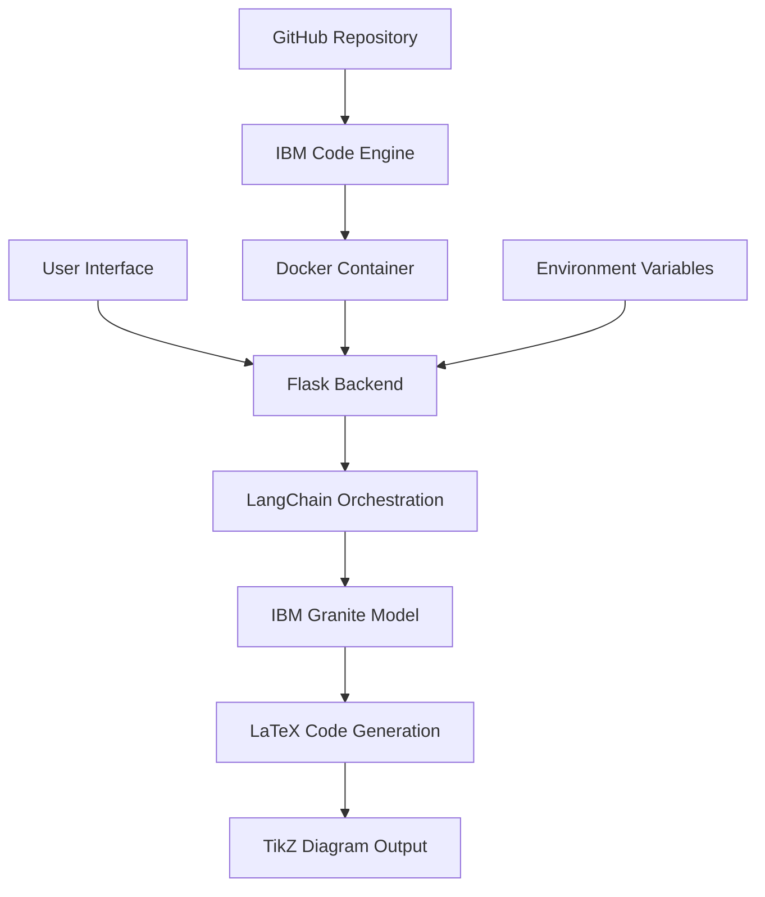

# 🤖 ScholarlyDraw : AI-Powered LaTeX Diagram Generator

<div align="center">

**An IBM Internship Project**

*Transform your ideas into professional LaTeX diagrams with the power of AI*

[](https://www.ibm.com/cloud)
[](https://python.org)
[](https://flask.palletsprojects.com/)
[](https://docker.com)
[](https://tailwindcss.com)

</div>

---

## 🎯 Overview

This project is an **advanced, AI-powered web application** that translates natural language descriptions into complete, compilable, and professional-quality LaTeX diagrams using the TikZ library. Developed as part of an IBM internship program, this tool leverages a modern, cloud-native tech stack to provide a seamless and intuitive user experience.

The application features a **conversational chatbot interface** where users can describe complex diagrams, such as system architectures, flowcharts, and neural networks, and receive ready-to-use LaTeX code in real-time.

## ✨ Features

🗣️ **Conversational UI**: An intuitive chatbot interface for describing diagrams

🧠 **Natural Language to Code**: Converts plain English descriptions into precise TikZ code

📄 **Full Document Generation**: Creates complete, runnable `.tex` files, including preambles and necessary packages

🔧 **Advanced Prompt Engineering**: Utilizes a robust prompt structure to ensure the AI defines custom styles and follows LaTeX syntax rules, minimizing errors

☁️ **Cloud-Native Deployment**: Fully containerized and deployed on IBM's scalable cloud infrastructure

## 🛠️ Professional Tech Stack

This project was built using a **professional-grade, end-to-end technology stack**, demonstrating expertise in modern AI and cloud development.

| Category | Technology / Service |
|----------|---------------------|
| **Cloud Platform** | IBM Cloud |
| **AI Platform** | IBM watsonx.ai |
| **Foundation Model** | IBM Granite (Code Instruct) |
| **Orchestration Framework** | LangChain |
| **Backend Server** | Python with Flask |
| **Production Web Server** | Gunicorn |
| **Frontend UI** | HTML5, Tailwind CSS, JavaScript |
| **Deployment Environment** | IBM Code Engine |
| **Containerization** | Docker |

## 🏗️ Architecture



## 🚀 Deployment

The application is deployed as a **containerized web service** on IBM Code Engine.

### Deployment Pipeline

1. **Source Code**: The application code is hosted in a GitHub repository
2. **Containerization**: A Dockerfile defines the environment, installing all dependencies and setting up the Gunicorn production server
3. **Cloud Build & Deploy**: IBM Code Engine automatically pulls the source code from GitHub, builds the Docker image, and deploys it as a live application
4. **Secure Configuration**: API keys and Project IDs are managed securely as environment variables within the Code Engine deployment, not hardcoded in the source

### Environment Variables

```bash
LATEX=your_ibm_watsonx_api_key
PROJECT_ID=your_ibm_project_id
```

## 📦 Installation & Local Development

### Prerequisites

- Python 3.8+
- Docker (for containerized deployment)
- IBM watsonx.ai API credentials

### Local Setup

1. **Clone the repository**
   ```bash
   git clone https://github.com/yourusername/scholarly-draw.git
   cd scholarly-draw
   ```

2. **Install dependencies**
   ```bash
   pip install -r requirement.txt
   ```

3. **Set environment variables**
   ```bash
   set LATEX=your_api_key
   set PROJECT_ID=your_project_id
   ```

4. **Run the application**
   ```bash
   python app.py
   ```

5. **Access the application**
   Open your browser and navigate to `http://localhost:8080`

### Docker Deployment

1. **Build the Docker image**
   ```bash
   docker build -t scholarly-draw .
   ```

2. **Run the container**
   ```bash
   docker run -p 8080:8080 -e LATEX=your_api_key -e PROJECT_ID=your_project_id scholarly-draw
   ```

## 🎨 Usage Examples

### Example 1: Flowchart
**Input**: "Create a flowchart showing the software development lifecycle"

**Output**: Complete LaTeX document with TikZ flowchart

### Example 2: Neural Network
**Input**: "Draw a simple neural network with 3 input nodes, 2 hidden layers, and 1 output node"

**Output**: Professional TikZ neural network diagram

### Example 3: System Architecture
**Input**: "Design a microservices architecture diagram with API gateway, databases, and load balancer"

**Output**: Comprehensive system architecture in LaTeX

## 🔧 Project Structure

```
scholarly-draw/
├── app.py                 # Main Flask application
├── DockerFile            # Container configuration
├── requirement.txt       # Python dependencies
├── index.html           # Frontend interface
└── README.md            # This file
```

## 🚀 Key Technical Achievements

- **AI Integration**: Successfully integrated IBM's Granite model with LangChain for sophisticated prompt engineering
- **Cloud-Native Design**: Built with scalability and production deployment in mind
- **Error Handling**: Robust error handling and validation for reliable diagram generation
- **Professional UI**: Clean, responsive interface using modern web technologies
- **Security**: Secure handling of API credentials through environment variables

## 🧪 Testing

The application includes comprehensive testing for:
- API endpoint validation
- LaTeX code generation accuracy
- Error handling scenarios
- Frontend-backend integration

## 📈 Future Enhancements

- [ ] Support for additional diagram types (UML, ER diagrams, etc.)
- [ ] Real-time LaTeX compilation and preview
- [ ] Export to multiple formats (PDF, SVG, PNG)
- [ ] User authentication and diagram saving
- [ ] Collaborative editing features
- [ ] Advanced styling options

## 🤝 Contributing

1. Fork the repository
2. Create a feature branch (`git checkout -b feature/amazing-feature`)
3. Commit your changes (`git commit -m 'Add amazing feature'`)
4. Push to the branch (`git push origin feature/amazing-feature`)
5. Open a Pull Request

## 📝 License

This project is licensed under the MIT License - see the [LICENSE](LICENSE) file for details.

## 🙏 Acknowledgments

- **IBM watsonx.ai team** for providing access to the Granite foundation model
- **IBM Cloud team** for the robust deployment infrastructure
- **LangChain community** for the excellent orchestration framework
- **LaTeX and TikZ communities** for the powerful diagramming capabilities

---

<div align="center">

**Built with ❤️ during IBM Internship Program**

*Transforming natural language into professional diagrams, one conversation at a time*

</div>
